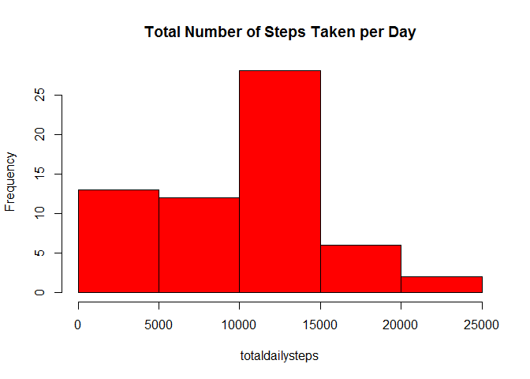
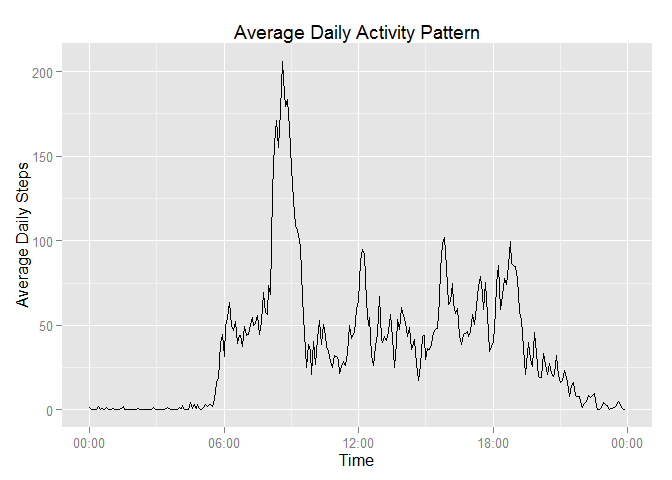
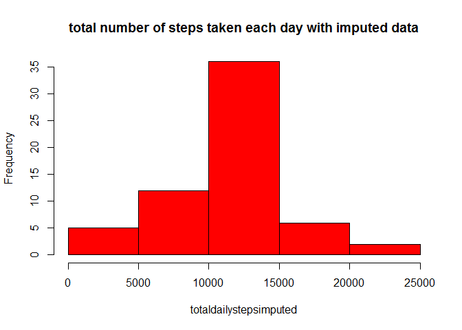
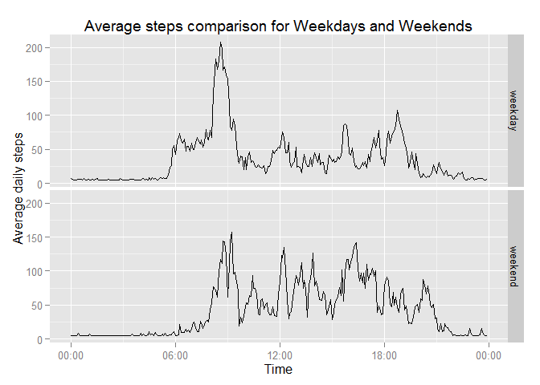

# PeerAssignmen1.Rmd
Set global parameters here
opts_chunk$set(echo=TRUE, results='asis')

##Loading and preprocessing the data
chunk1 - set current directory as working directory

```r
setwd("./")
```
chunk2 - load following libraries

```r
library(downloader)
library(data.table)
library(ggplot2)
```

```
## Warning: package 'ggplot2' was built under R version 3.1.3
```

```r
library(scales)
```

```
## Warning: package 'scales' was built under R version 3.1.3
```

```r
library(Hmisc)
```

```
## Warning: package 'Hmisc' was built under R version 3.1.3
```

```
## Loading required package: grid
## Loading required package: lattice
```

```
## Warning: package 'lattice' was built under R version 3.1.3
```

```
## Loading required package: survival
```

```
## Warning: package 'survival' was built under R version 3.1.3
```

```
## Loading required package: Formula
```

```
## Warning: package 'Formula' was built under R version 3.1.3
```

```
## 
## Attaching package: 'Hmisc'
## 
## The following objects are masked from 'package:base':
## 
##     format.pval, round.POSIXt, trunc.POSIXt, units
```
chunk3 - download activity.zip file from provided URL, unzip the file to activity.csv and read into variable "data"

```r
url <- "https://d396qusza40orc.cloudfront.net/repdata%2Fdata%2Factivity.zip"
url_file <- "activity"
download(url, dest=url_file, mode="wb")
workdir <- getwd()
unzip (url_file, exdir = workdir)
data <- fread("activity.csv")
```
## What is mean total number of steps taken per day?

chunk4 - using tapply function to calcualet mean total number of steps taken per day, also ignoring the missing data (NAs). calculate mean and median for total number of steps taken per day. finally plot a histogram for total number of steps taken per day.

```r
totaldailysteps <- tapply(data$steps, data$date, sum, na.rm=TRUE)
mean(totaldailysteps)
```

```
## [1] 9354.23
```

```r
hist(totaldailysteps, col="red", main="Total Number of Steps Taken per Day")
```

 


##What is the average daily activity pattern?

chunk5 - to create the average daily steps time series plot, we have to create a new time variable using date + interval and mean of the daily steps for that time.


```r
time <- formatC(data$interval / 100, 2, format='f')
data$datetime <- as.POSIXct(paste(data$date, time), format='%Y-%m-%d %H.%M', tz='GMT')
data$time <- format(data$datetime, format='%H:%M:%S')
data$time <- as.POSIXct(data$time, format='%H:%M:%S')
averagesteps <- tapply(data$steps, data$time, mean, na.rm=TRUE)
dfstepstime <- data.frame(time=as.POSIXct(names(averagesteps)), averagesteps=averagesteps)
```
chunk6 - plot average daily steps time series

```r
ggplot(dfstepstime, aes(time, averagesteps)) + ggtitle("Average Daily Activity Pattern") +
    geom_line() +
    xlab('Time') +
    ylab('Average Daily Steps') +
    scale_x_datetime(labels=date_format(format='%H:%M'))
```

 

##Which five minute interval has the highest mean number of steps?
chunk7 - using max to identify time range with the highest mean number of steps

```r
highaveragesteps <- which.max(dfstepstime$averagesteps)
format(dfstepstime[highaveragesteps,'time'], format='%H:%M')
```

```
## [1] "08:35"
```

##Imputing missing values

chunk8 - 
1) to Calculate and report the total number of missing values in the dataset (i.e. the total number of rows with NAs)
2) use mean steps in range to fill the missing values (NAs).
3) create new dataset with the missing values (NAs)filled.
4) Plot a histogram with the mean and median with imputed steps for each day.


```r
summary(data$steps)
```

```
##    Min. 1st Qu.  Median    Mean 3rd Qu.    Max.    NA's 
##    0.00    0.00    0.00   37.38   12.00  806.00    2304
```

```r
datafilled <- data
datafilled$steps <- with(datafilled, impute(steps, mean))

totaldailystepsimputed <- tapply(datafilled$steps, 
                              datafilled$date, sum)
mean(totaldailysteps)
```

```
## [1] 9354.23
```

```r
mean(totaldailystepsimputed)
```

```
## [1] 10766.19
```

```r
median(totaldailysteps)
```

```
## [1] 10395
```

```r
median(totaldailystepsimputed)
```

```
## [1] 10766.19
```

```r
hist(totaldailystepsimputed, col="red", main = "total number of steps taken each day with imputed data")
```

 

Increase in average number of steps due to Imputing the missing data compared to original data.

##Are there differences in activity patterns between weekdays and weekends?

chunk9 - Identify if day is weekend or weekday. Create a new dataframe with the daily average steps for weekdays and weekend.


```r
weekdayweekend <- function(date) {
    if (weekdays(date) %in% c('Saturday', 'Sunday')) {
        return('weekend')
    } else {
        return('weekday')
    }
}

weekdayweekend <- sapply(datafilled$datetime, weekdayweekend)
datafilled$weekdayweekend <- as.factor(weekdayweekend)

averagesteps <- tapply(datafilled$steps, 
                     interaction(datafilled$time,
                                 datafilled$weekdayweekend),
                     mean, na.rm=TRUE)
dfweekdayweekendtime <- data.frame(time=as.POSIXct(names(averagesteps)),
                               averagesteps=averagesteps,
                               weekdayweekend=as.factor(c(rep('weekday', 288),
                                                   rep('weekend', 288))))
```

Chunk10 - ggplot to compare Average daily steps between weekdays and weekends.


```r
ggplot(dfweekdayweekendtime, aes(time, averagesteps)) + ggtitle("Average steps comparison for Weekdays and Weekends") + 
    geom_line() +
    xlab('Time') +
    ylab('Average daily steps') +
    scale_x_datetime(labels=date_format(format='%H:%M')) +
    facet_grid(weekdayweekend~.)
```

 


Based on a review of these plots, even though the average maximum number of steps in any one interval occurs during the week, there is an overall higher number steps taken in the aggregate over the weekend.
